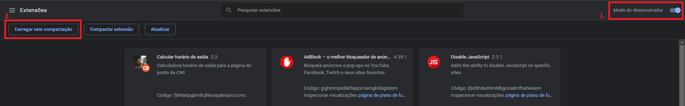
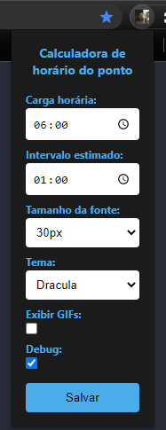

## Instalação:

1. Acesse a [página de gerenciar extensões](chrome://extensions/) no Google Chrome.
2. Ative o modo desenvolvedor e clique em `carregar sem compactação`.
3. Procure a pasta da extensão e clique em selecionar pasta.

## Configurações:

As preferências de uso podem ser configuradas clicando no popup da extensão:

- **Carga Horária:** A carga horária que você trabalha.
- **Intervalo estimado:** O tempo apróximado que você fica no intervalo. A extensão irá usar esse valor para simular o horário de saída antes mesmo do usuário ter feito o intervalo. Quando o intervalo real for feito, ela passará a usar o real. Caso não faça intervalos, poderá setar para 00:00.
- **Tamanho da fonte:** Tamanho da fonte da mensagem injetada na tela.
- **Tema:** Tema personalizado para a página. Caso esteja selecionado como "Padrão", nenhum estilo será aplicado.
- **Exibir GIFs:** Caso ativo, irá exibir alguns GIFs representando cada período da jornada de trabalho.
- **Debug:** Irá imprimir alguns logs no console que podem ser utilizados para debugar a extensão.
